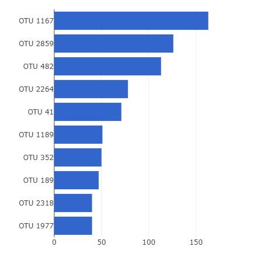
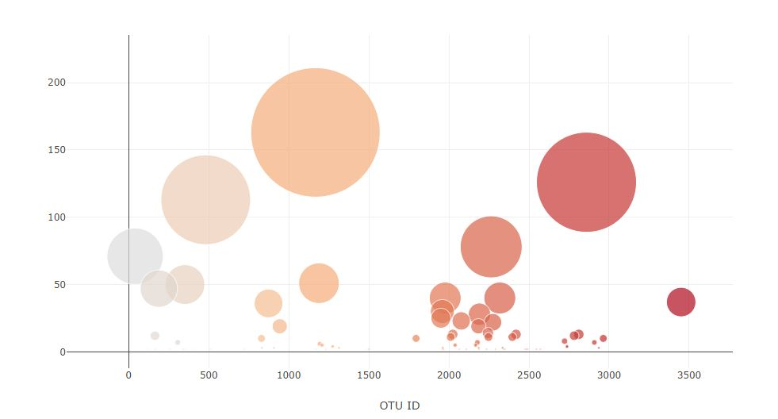
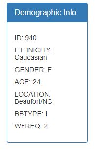

# Plotly-challenge - Belly Button Biodiversity

[Github Pages Link Here](https://andresocorro.github.io/plotly-challenge/)

This homework consisted in being able to build an interactive dashboard using Plotly. 

The data is in a json called data.json. The data consists on exploring the biodiversity on a human's belly button. It includes a small handful of microbial species called operational taxonomic units (OTU) and using D3 library we were able to build the following:

## Bar Graph

A horizontal bar graph that displays the top 10 OTUs found on a specific individual. This individual is selected by a dropdown option

This bar graph shows what OTUs are found in an individual and how often

## Bubble Chart

A bubble chart displaying similar data but for all items to visualize the OTUs and their values

## Demographic Info

A quick summary describing the subject being studied. It's ID, ethnicity and some general background info on the individual

